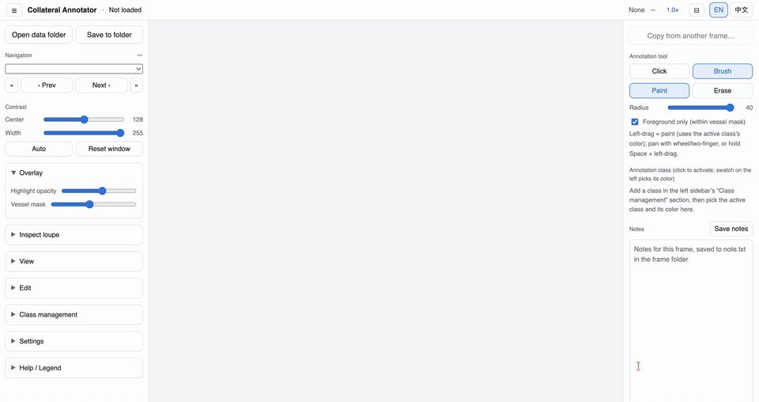
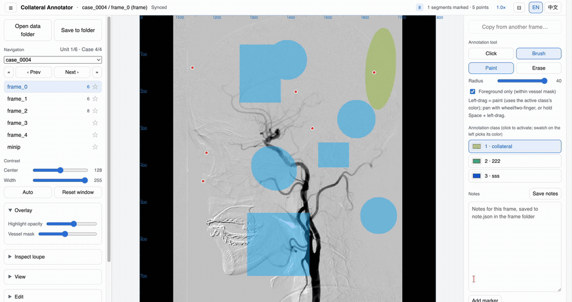
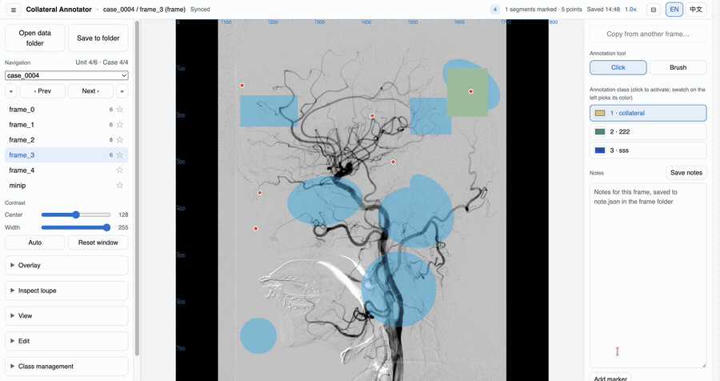
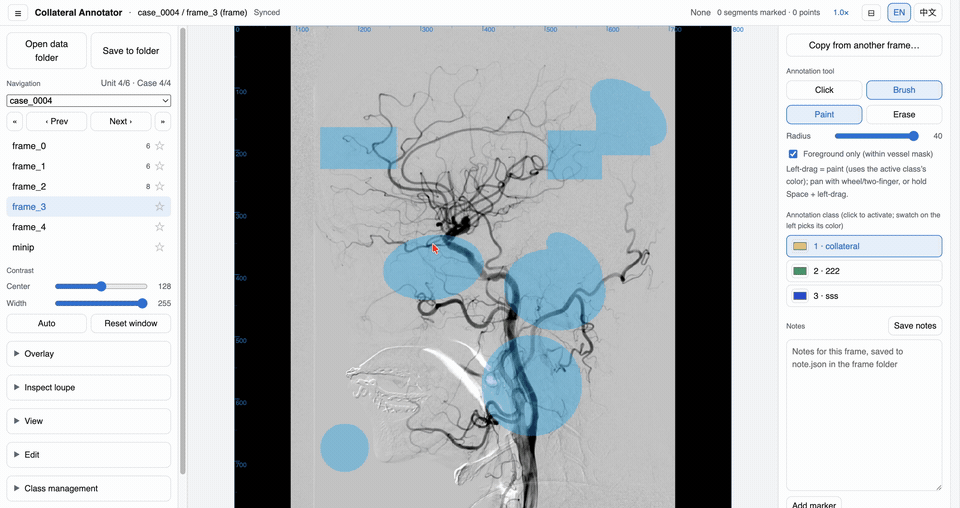
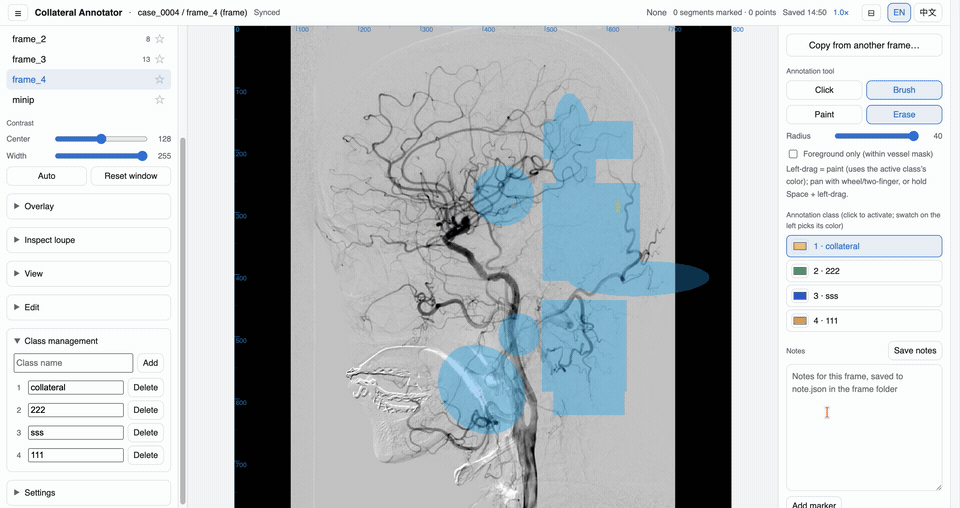

# Collateral Annotator

**English** · [中文](README.zh-CN.md)

A browser tool for labeling collateral vessel segments on DSA (digital subtraction angiography) frames. Click a pre-segmented vessel segment to mark it, paint free-form regions, drop notes and markers — everything is written straight to your local folder.

**Live app: https://jctaylor666.github.io/collateral-annotator/**

> ⚠️ **Use Chrome or Edge.** The tool writes files directly to a folder on your computer via the File System Access API, which only Chromium-based browsers support. Safari and Firefox can open the page but cannot open a data folder.

---

## Data folder layout

Point the tool at a **data root** that looks like this:

```
<data root>/            ← the folder you open
├─ classes.json         ← class definitions (created/updated by the tool)
├─ case_0001/           ← one case, named case_<digits>
│  ├─ frame_0/          ← one frame, named frame_<digits>
│  │  ├─ frames.png     ← required · the DSA image (grayscale)
│  │  ├─ label.npy      ← required · per-pixel segment ids (this frame's segmentation)
│  │  ├─ mask.npy       ← optional · 0/1 vessel mask
│  │  ├─ annotation.json← written by the tool
│  │  └─ note.json      ← written by the tool
│  └─ minip/            ← min-intensity projection, always listed last
└─ case_0002/ …
```

Only folders named `case_<digits>` are treated as cases, and inside them only `frame_<digits>` and `minip`. `frames.png` and `label.npy` are required and **must have matching dimensions** (W = label width, H = label height) or the frame won't load. Segmentation is **per-frame** — the same segment id does not correspond across frames.

---

## Features

### 1. Open a data folder



Click **Open data folder** and pick your data root.

- **Requires Chrome/Edge** (File System Access API); the browser will ask permission to read/write the folder.
- On open, the tool scans every frame to build the frame list, and auto-adds any class that is used in an annotation but missing from `classes.json`.
- If the folder contains no `case_<digits>` subfolders, nothing loads and a warning appears.

### 2. Select a case and navigate frames



Pick a case from the dropdown at the top of the left rail, then click a frame in the list below it.

- **← / →** step to the previous/next frame (wrapping across cases); the `«` `»` buttons jump case, `‹` `›` jump frame.
- The number next to a frame is **how many marks that frame has**; visited frames are shown darker.
- Click the **★** on a frame to flag it. If any frame in a case is starred, the case shows a ★ in the dropdown.

### 3. Annotate a segment



*(This clip is sped up.)*

Pick the active class in the right panel (**Annotation class**), then click on the image.

- **Click a vessel segment** → it's marked as collateral in the active class's color. **Click it again with the same class** → the mark is removed. **Click it with a different active class** → it's reassigned to that class.
- **Click background** (no vessel) → a red dot is recorded at that spot. **Click near an existing red dot** → that dot is deleted.
- The color comes from the class you selected on the right. With no class defined, marks fall back to green.
- With **auto-save** on (default), every change is written to `annotation.json` about a second later.

### 4. Copy annotation from another frame



Reuse the marks you already made on a neighboring frame.

- ⚠️ **The button is only enabled when the current frame has no marks.** If you've already annotated this frame, clear it first (or it stays disabled).
- Click **Copy from another frame…**, the frame list highlights, then click the frame you want to copy from. Press **Esc** to cancel.
- Each source click is **re-resolved against the current frame's own segmentation** (segmentation differs per frame): a click that lands on a segment marks that segment; a click on background becomes a red dot.
- **Clicks that had no class are dropped.** If two source clicks land on the same target segment, the **first one wins**.

### 5. Inspect loupe (hold Cmd / Ctrl)


**Hold Cmd (Mac) or Ctrl (Windows)** while the cursor is over the image.

- A panel opens showing the current frame and its **± neighbor frames** as magnified crops centered under the cursor, plus a **cross-frame raw-grayscale curve** (the minip sits to the right of the dashed line) so you can see how a spot's intensity changes across the series.
- **You can still click to annotate while inspecting** — the loupe doesn't block anything.
- Release the key to close it (it also closes if you switch tabs).
- In the **Inspect loupe** settings: *Zoom* (magnification), *Neighbor frames* (how many ± to show), *3×3 mean*, and *View size* (bigger tiles = wider field of view; the panel widens to fit).

### 6. Notes and markers



Each frame has its own note, saved to `note.json`.

- Type in the **Notes** box; **Save notes** (or auto-save) writes it to disk.
- Click **Add marker**, then click once on the image to drop a **numbered circle** at that spot. Numbers increment (1, 2, 3, …) and stay stable — deleting one never renumbers the others.
- Delete a marker with the **×** on its chip below the note; hovering a chip highlights that circle on the image.
- **Cmd+Z** undoes a marker (or any annotation).

---

## Where your work is saved

Everything is written **inside your data folder**, per frame:

- `annotation.json` — marked segments, background red dots, brush paint, and the star flag.
- `note.json` — the frame's note text and its numbered markers.
- `classes.json` (at the data root) — class index → name. Colors are **not** stored here; they live only in your browser.

Coordinates use the order set in **Settings → Coordinate order** (`xy` = `[x, y]`, `yx` = `[y, x]`; default `xy`, origin at the top-left). Open the in-app **Help → Data format** for the full field-by-field reference.
