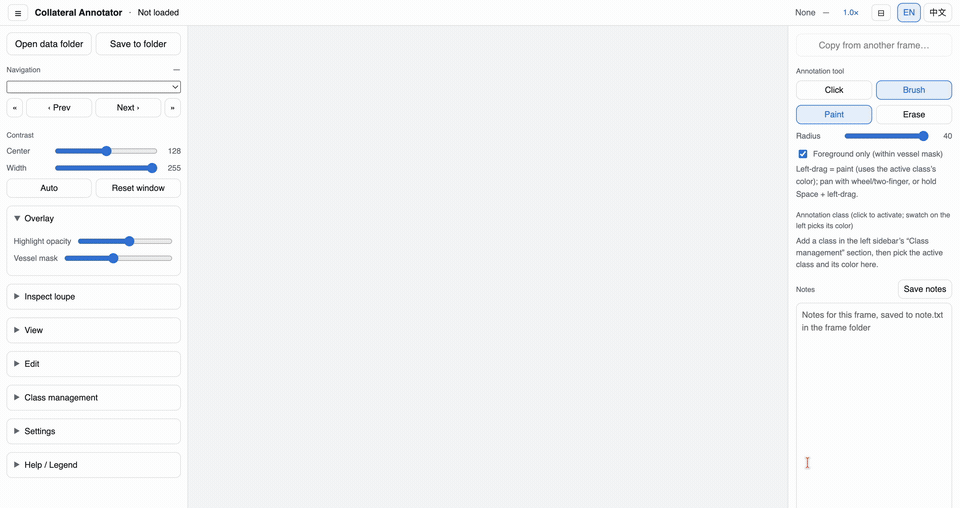
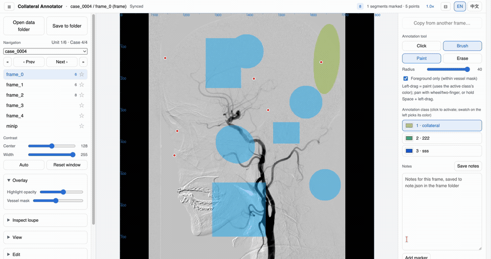
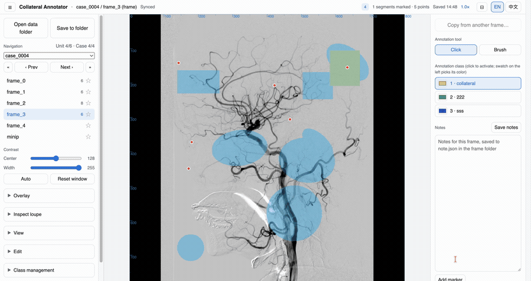
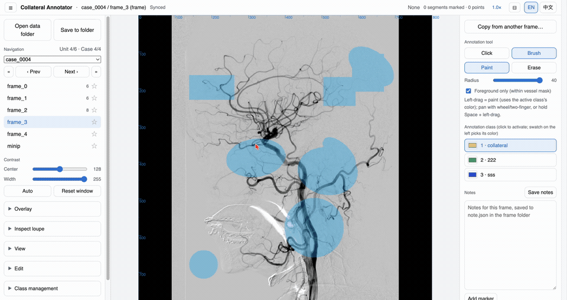
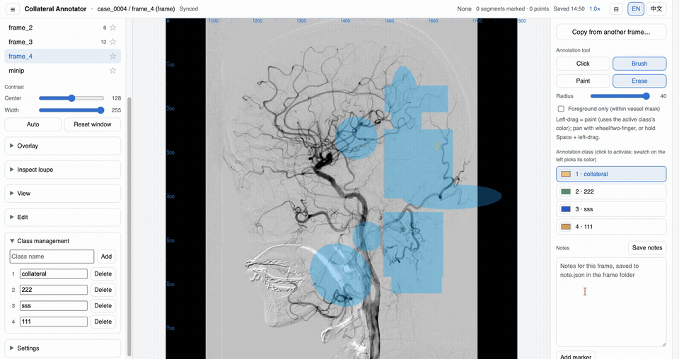

# Collateral Annotator

**English** · [中文](README.zh-CN.md)

A browser tool for labeling collateral vessel segments on DSA (digital subtraction angiography) frames. Click a pre-segmented vessel segment to mark it, paint free-form regions, drop notes and markers — everything is written straight to your local folder.

**Live app: https://jctaylor666.github.io/collateral-annotator/**

> ⚠️ **Use Chrome or Edge.** The tool writes files directly to a folder on your computer via the File System Access API, which only Chromium-based browsers support. Safari and Firefox can open the page but cannot open a data folder.

---

## Data folder layout

Point the tool at a **data root** that looks like this:

```
<data root>/            ← the folder you open
├─ classes.json         ← class definitions (created/updated by the tool)
├─ case_0001/           ← one case, named case_<digits>
│  ├─ frame_0/          ← one frame, named frame_<digits>
│  │  ├─ frames.png     ← required · the DSA image (grayscale)
│  │  ├─ label.npy      ← required · per-pixel segment ids (this frame's segmentation)
│  │  ├─ mask.npy       ← optional · 0/1 vessel mask
│  │  ├─ annotation.json← written by the tool
│  │  └─ note.json      ← written by the tool
│  └─ minip/            ← min-intensity projection, always listed last
└─ case_0002/ …
```

A folder is a case (and, inside it, a unit) if its name **carries a number** — pure digits, a trailing `_<digits>`, or a leading `<digits>_`; the rest of the name is free (`case_0001`, `frame_3`, `12_patient`, `7`). A unit named exactly `minip` is also loaded and always sorts last. Anything else is skipped **in silence**. `frames.png` and `label.npy` are required and **must have matching dimensions** (W = label width, H = label height) or the frame won't load. Segmentation is **per-frame** — the same segment id does not correspond across frames.

---

## Features

### 1. Open a data folder



Click **Open data folder** and pick your data root.

- **Requires Chrome/Edge** (File System Access API); the browser will ask permission to read/write the folder.
- On open, the tool scans every frame to build the frame list, and auto-adds any class that is used in an annotation but missing from `classes.json`.
- If the folder contains no `case_<digits>` subfolders, nothing loads and a warning appears.

### 2. Select a case and navigate frames



Pick a case from the dropdown at the top of the left rail, then click a frame in the list below it.

- **← / →** step to the previous/next frame (wrapping across cases); the `«` `»` buttons jump case, `‹` `›` jump frame.
- The number next to a frame is **how many marks that frame has**; visited frames are shown darker.
- Click the **★** on a frame to flag it. If any frame in a case is starred, the case shows a ★ in the dropdown.

### 3. Annotate a segment




Pick the active class in the right panel (**Annotation class**), then click on the image.

- **Click a vessel segment** → it's marked as collateral in the active class's color. **Click it again with the same class** → the mark is removed. **Click it with a different active class** → it's reassigned to that class.
- **Click background** (no vessel) → a red dot is recorded at that spot. **Click near an existing red dot** → that dot is deleted.
- The color comes from the class you selected on the right. With no class defined, marks fall back to green.
- With **auto-save** on (default), every change is written to `annotation.json` about a second later.

### 4. Copy annotation from another frame



Reuse the marks you already made on a neighboring frame.

- ⚠️ **The button is only enabled when the current frame has no marks.** If you've already annotated this frame, clear it first (or it stays disabled).
- Click **Copy from another frame…**, the frame list highlights, then click the frame you want to copy from. Press **Esc** to cancel.
- Each source click is **re-resolved against the current frame's own segmentation** (segmentation differs per frame): a click that lands on a segment marks that segment; a click on background becomes a red dot.
- **Clicks that had no class are dropped.** If two source clicks land on the same target segment, the **first one wins**.

### 5. Inspect loupe (hold Cmd / Ctrl)


**Hold Cmd (Mac) or Ctrl (Windows)** while the cursor is over the image.

- A panel opens showing the current frame and its **± neighbor frames** as magnified crops centered under the cursor, plus a **cross-frame raw-grayscale curve** (the minip sits to the right of the dashed line) so you can see how a spot's intensity changes across the series.
- **You can still click to annotate while inspecting** — the loupe doesn't block anything.
- Release the key to close it (it also closes if you switch tabs).
- In the **Inspect loupe** settings: *Zoom* (magnification), *Neighbor frames* (how many ± to show), *3×3 mean*, and *View size* (bigger tiles = wider field of view; the panel widens to fit).

### 6. Notes and markers



Each frame has its own note, saved to `note.json`.

- Type in the **Notes** box; **Save notes** (or auto-save) writes it to disk.
- Click **Add marker**, then click once on the image to drop a **numbered circle** at that spot. Numbers increment (1, 2, 3, …) and stay stable — deleting one never renumbers the others.
- Delete a marker with the **×** on its chip below the note; hovering a chip highlights that circle on the image.
- **Cmd+Z** undoes a marker (or any annotation).

---

## Where your work is saved

Everything is written **inside your data folder**, per frame:

- `annotation.json` — marked segments, background red dots, brush paint, and the star flag.
- `note.json` — the frame's note text and its numbered markers.
- `classes.json` (at the data root) — class index → name. Colors are **not** stored here; they live only in your browser.

Coordinates use the order set in **Settings → Coordinate order** (`xy` = `[x, y]`, `yx` = `[y, x]`; default `xy`, origin at the top-left). Open the in-app **Help → Data format** for the full field-by-field reference.

---

## Prompt for an AI agent to prepare a dataset

Everything an agent needs in order to build a dataset this tool can open, in one
self-contained block. It assumes **no prior context** — copy the whole thing.
The same text is in the app under **Data format… → Copy for an AI agent**, and
that copy is the one kept in sync with the code.

<details>
<summary><b>Click to expand the full specification</b></summary>

````text
You are preparing an on-disk dataset for "Collateral Annotator", a browser tool
that labels leptomeningeal-collateral vessel segments on DSA (digital subtraction
angiography) frames. This message is a COMPLETE, self-contained specification.
Assume NO prior context. Follow it exactly.

========================================
WHAT THE TOOL DOES
========================================
The reviewer opens a local folder in Chrome or Edge (File System Access API; no
server, no install, nothing uploaded). For each DSA frame it shows the image with
your vessel segmentation on top. The reviewer then:
  - CLICKS a pre-segmented vessel segment to mark it as collateral (the segment
    is looked up in label.npy at the cursor);
  - PAINTS free-form regions with a brush that can be constrained to the vessel
    mask;
  - filters the visible segments by any per-segment metric you supply (radius,
    length, ...);
  - writes notes and numbered markers.
Everything is saved straight back into the same folder as JSON. Your job is to
produce the INPUT files; the tool produces the OUTPUT files.

========================================
FOLDER STRUCTURE
========================================
<root>/                              <- the folder the reviewer opens
  classes.json                       INPUT + OUTPUT (ship one; the tool updates it)
  .annotator_dataset.json            OUTPUT, hidden. Do not create one.
  <case folder>/                     one per case/sequence
    <unit folder>/                   one per frame; plus optional "minip"
      frames.png                     INPUT, required
      label.npy                      INPUT, required
      mask.npy                       INPUT, optional
      geometry.json                  INPUT + OUTPUT, optional
      annotation.json                OUTPUT (you MAY pre-fill it; see below)
      note.json                      OUTPUT
      annotation.json.corrupt        OUTPUT, recovery only
      annotation.unsaved-backup.json OUTPUT, recovery only
      note.unsaved-backup.json       OUTPUT, recovery only

Do NOT create a "perfusion" folder. The tool appends one computed, view-only
"perfusion" unit to every case, after minip. It has no files on disk, no label,
no mask and no geometry, and can never be annotated.

========================================
FOLDER NAMING & ORDERING
========================================
- A folder is a case (and, inside it, a unit) if its name CARRIES A NUMBER:
  pure digits, a trailing _<digits>, or a leading <digits>_. The rest of the name
  is free. Valid: case_0001, frame_3, 12_patient, 0_scan, 7. INVALID: "s0", "f1",
  "minip_left" -- these are SKIPPED IN SILENCE and never appear in the UI.
- A unit folder named exactly "minip" is also loaded and always sorts last.
- Units sort by their number (frame_2 before frame_10); cases sort by theirs.
  Numbers need NOT start at any particular value and need NOT be contiguous.
- Hidden folders (leading "."), folders with no number, and loose files are
  ignored.

========================================
COORDINATE CONVENTION (CRITICAL)
========================================
- Origin top-left. x = column index (0 = left). y = row index (0 = top).
- Everything is H rows by W columns. Flat index = y*W + x. NumPy shape = (H, W),
  so H = shape[0], W = shape[1].
- frames.png, label.npy and mask.npy (if present) MUST have EXACTLY the same W
  and H. If they disagree, that frame becomes a grey read-only placeholder.

========================================
INPUT FILES -- WHAT YOU PRODUCE
========================================
frames.png   (required)
  Grayscale PNG of the DSA frame, W x H. The tool reads the RED channel as the
  raw 0-255 gray value for contrast windowing and the inspect loupe. Save 8-bit
  grayscale ("L"); do not save 16-bit.

label.npy   (required) -- the segmentation, split into segments
  NumPy 2-D array, shape (H, W), C-order, little-endian. dtype uint16 preferred
  (uint8 / int32 / uint32 also accepted). fortran_order=True is REJECTED.
  Pixel value 0 = background; 1..N = segment id. Ids are PER FRAME and do not
  correspond across frames. Clicking selects the id under the cursor, so the
  granularity of this file IS the granularity of the annotation: one id per
  vessel branch is usually what you want, not one id per connected tree.

mask.npy   (optional)
  2-D (H, W) uint8 of 0/1: the vessel foreground. Drawn as the blue overlay and
  used to constrain the brush when "Foreground only" is on. If absent there is
  simply no overlay. If PRESENT it must match W x H exactly -- a wrong-shaped or
  truncated mask triggers the grey placeholder rather than being ignored.
  Normally mask == (label > 0).

geometry.json   (optional; the tool writes back only "filter")
  { "segments": { "1":  { "radius_px": 2.0, "length_px": 40.0 },
                  "12": { "radius_px": 16.0, "length_px": 12.0 } },
    "filter":   { "metric": "radius_px", "min": 4.8, "max": 15.4 } }
  - "segments" is keyed by the label id AS A STRING; background 0 is excluded.
    Each value is an object of NAMED NUMERIC METRICS -- any names, any number of
    them. This drives the "Segment geometry" panel: pick a metric, see count /
    min / max / mean / median, and filter the display by a range.
  - "filter" is the reviewer's saved window; the tool rewrites it whenever the
    sliders move. Set it at generation time to the first metric's full range.
  - Everything else in the file is preserved verbatim.

classes.json   (at the root -- SHIP THIS)
  { "classes": [ { "index": 1, "name": "Collateral" } ] }
  "index" is the number stored in annotations; "name" is the display name.
  Colors are NOT stored here. IF THIS FILE IS MISSING the tool invents a RANDOM
  name for every class index it finds and writes a new classes.json -- two copies
  of one dataset then disagree on class names. Always ship it.

========================================
OUTPUT FILES -- WHAT THE TOOL WRITES
========================================
annotation.json   (schema 5; you may pre-fill it, see "PRE-FILLING")
  { "schema_version": 5, "case": "case_0001", "unit": "frame_0",
    "image_size": [W, H], "coord_order": "xy",
    "collaterals": [ { "id": 12, "click": [321, 187], "class": 2 } ],
    "points":      [ { "click": [40, 500], "class": 1 } ],
    "starred": true,
    "paint": { "encoding": "rle_rows_v1",
               "width": W, "height": H,
               "classes": { "2": [[10, 40, 12], [11, 39, 14]] } } }
  - collaterals -- one entry per SELECTED SEGMENT. "id" is the label.npy id;
    "click" is where the reviewer clicked; "class" is omitted when unclassified.
    NOTE: the shape is NOT stored -- it is resolved from label.npy at display
    time. See "SEGMENT IDS ARE NOT STABLE".
  - points -- clicks that hit background (id 0), same click/class shape.
  - coord_order -- "xy" => click = [x, y]; "yx" => click = [y, x]. It applies to
    collaterals[].click and points[].click ONLY, NEVER to paint.
  - paint -- the brush layer, row run-length encoded. classes maps class index
    (as a string, must be >= 1) to a list of runs [row, col, length]:
    row = y from the top, col = x of the run start, length = consecutive pixels
    toward +x. width/height are the dimensions it was encoded at.
  - starred -- present only when true.

schema 6 (layers). A frame may hold several independent layers. With ONE layer
the file stays flat schema 5 exactly as above. With TWO OR MORE, the per-layer
content moves into a "layers" array:
  { "schema_version": 6, "case": ..., "unit": ..., "image_size": [W, H],
    "coord_order": "xy", "active_layer": 1,
    "layers": [ { "id": 0, "name": "Layer 1", "collaterals": [...],
                  "points": [...], "paint": {...} },
                { "id": 1, "name": "Veins", "collaterals": [], "points": [] } ] }
  Frame-level fields (starred, note.json) are NOT layered. Deleting down to one
  layer makes the next save collapse back to flat schema 5.

note.json
  { "schema_version": 1, "coord_order": "xy", "text": "free-text note",
    "markers": [ { "id": 1, "click": [321, 187] } ] }

.annotator_dataset.json  (root, hidden)
  { "id": "d3f1a2..." } -- created on first open. In-browser progress is keyed to
  this id so two datasets that both use case_1/frame_0 never bleed together. Safe
  to delete (resets browser state only) and safe to omit from an archive.

RECOVERY FILES -- written only when something is wrong, never read back:
  annotation.json.corrupt / classes.json.corrupt -- an unparseable file is copied
    here ONCE before anything overwrites it.
  annotation.unsaved-backup.json / note.unsaved-backup.json -- if the browser
    holds unsaved edits and the file on disk turns out to be NEWER, the edits go
    here rather than being dropped or overwriting the newer file.

========================================
HOW TO PREPARE A DATASET -- STEP BY STEP
========================================
STEP 1. What you need to start
  - the DSA frames of each sequence, as images;
  - a binary vessel segmentation for each frame (your own model);
  - optionally, existing region annotations you want to carry in.

STEP 2. Fix the image grid, once per frame
  Decide W x H now and use it for the image, the mask and the label. If you crop
  or resize, do it BEFORE anything else -- every downstream file must agree.
  Save the image as 8-bit grayscale PNG.

STEP 3. Turn the binary mask into segments (this is the important step)
  label.npy is what the reviewer clicks, so its granularity IS the annotation's
  granularity. Two options:
  (a) Connected components -- one id per connected vessel tree. Trivial, but
      usually far too coarse: one click selects the whole tree.
        from scipy import ndimage
        label, n = ndimage.label(mask)              # rarely what you want
  (b) Branch-level partition -- one id per vessel branch. This is what you
      normally want:
        1. skeletonize the mask                   (skimage.morphology.skeletonize)
        2. count 8-neighbours of every skeleton pixel; pixels with 3+ neighbours
           are branch points, 1 neighbour are endpoints
        3. remove the branch points; each remaining connected run of skeleton is
           one CHAIN = one segment
        4. assign EVERY foreground pixel to the nearest chain
           (scipy.spatial.cKDTree over the chain pixels)
        5. number the chains 1..N and write that as label.npy
      Keep closed rings as their own chain and never merge two chains that meet
      only at a branch point -- merging is what makes segments too coarse.
  Whichever you choose: ids must be 1..N with no gaps, 0 = background, and
  (label > 0) must equal your mask pixel for pixel.

STEP 4. Per-segment metrics -> geometry.json
  Any numeric metric works; these are the useful ones:
    radius     median of the Euclidean distance transform sampled along the
               segment's skeleton (diameter = 2x this). This is the robust one --
               it is not thrown off by a bulge at one end.
                 from scipy.ndimage import distance_transform_edt
                 dt = distance_transform_edt(mask)
                 radius = float(np.median(dt[chain_pixels]))
    length     path length along the skeleton; sum the step distances, using
               sqrt(2) for diagonal steps, not 1.
    area       pixel count of the segment
    mean_width area / length -- an independent width estimate; disagreement with
               radius is a useful red flag
    tortuosity length / straight-line distance between the two ends; 1.0 = straight
  Emit them all; the reviewer picks which to filter on. Set "filter" to the first
  metric's full range so the panel opens usable.
  If your images have no physical pixel spacing, say so in your own docs: these
  are PIXEL measurements and are NOT comparable across sequences of different
  resolution.

STEP 5. (Optional) Pre-fill annotations
  If you already have regions to carry in, write them as PAINT, not as
  collaterals[]. Paint stores pixels and survives a future re-partition;
  collaterals[] stores only ids and does not. Encode row-run-length:
        runs = []
        for y in range(H):
            cols = np.flatnonzero(region[y])
            if cols.size == 0: continue
            cut    = np.flatnonzero(np.diff(cols) != 1)
            starts = np.concatenate(([0], cut + 1))
            ends   = np.concatenate((cut, [cols.size - 1]))
            for s, e in zip(starts, ends):
                runs.append([int(y), int(cols[s]), int(cols[e] - cols[s] + 1)])
  then write annotation.json with paint.width/height set to THIS frame's W/H and
  classes = {"1": runs}. Declare class 1 in classes.json. Do not fabricate an
  empty annotation.json for a frame with nothing in it -- omit the file.

STEP 6. Validate before shipping
  For every unit, assert:
    - frames.png, label.npy and mask.npy have identical W x H;
    - label.npy is 2-D, C-order, dtype in {uint16, uint8, int32, uint32};
    - (label > 0) equals mask exactly;
    - geometry.json keys == the ids actually present in label.npy;
    - every paint block's width/height == that frame's W/H;
    - every class index used anywhere is declared in classes.json;
    - every folder name would be discovered (carries a number, or is "minip").

COMPLETE MINIMAL EXAMPLE (one valid frame)
  import numpy as np, json, os
  from PIL import Image
  H = W = 512
  gray  = (np.random.rand(H, W) * 255).astype(np.uint8)
  label = np.zeros((H, W), np.uint16)
  label[100:140, 50:400] = 1                 # segment 1
  label[200:260, 80:380] = 2                 # segment 2
  d = "case_0001/frame_0"; os.makedirs(d, exist_ok=True)
  Image.fromarray(gray, "L").save(d + "/frames.png")
  np.save(d + "/label.npy", label)           # (H, W) uint16, C-order
  np.save(d + "/mask.npy", (label > 0).astype(np.uint8))
  json.dump({"segments": {"1": {"radius_px": 3.0}, "2": {"radius_px": 5.0}},
             "filter": {"metric": "radius_px", "min": 3.0, "max": 5.0}},
            open(d + "/geometry.json", "w"), indent=2)
  json.dump({"classes": [{"index": 1, "name": "Collateral"}]},
            open("classes.json", "w"), indent=2)

========================================
FAILURES THAT ARE SILENT -- NOTHING WILL WARN YOU
========================================
- PAINT AT THE WRONG SIZE IS DISCARDED. If paint.width/height differ from the
  frame's W/H the brush layer is not decoded: no marks, no warning, no error.
  (The stored RLE is preserved, so load+save cannot destroy it -- but nothing
  shows.) Always write width/height from the array you encoded.
- A FOLDER WHOSE NAME CARRIES NO NUMBER IS SKIPPED, with no message.
- A MISSING classes.json IS SILENTLY REPLACED by one with invented names.
By contrast a W x H disagreement between frames.png / label.npy / mask.npy is
LOUD: that frame becomes a grey read-only placeholder listing the three shapes.

========================================
SEGMENT IDS ARE NOT STABLE IDENTIFIERS
========================================
collaterals[].id and the keys of geometry.json store ONLY a number; the shape is
resolved from label.npy at display time. Regenerating label.npy therefore
re-points every existing selection at whatever segment now carries that number,
silently.
- Ids are assigned deterministically by position, so SMALL changes are harmless:
  re-running the same partition, deleting one pixel, or adding a speck elsewhere
  leaves every id intact (measured).
- Replacing the MASK -- a better segmentation model, a changed partition rule --
  renumbers essentially everything. Measured on four sequences after swapping one
  vessel model for another, of the pixels that are foreground in BOTH masks the
  fraction keeping its old id was 0.73 %, 0.01 %, 0.00 %, 0.00 %.
- So: NEVER regenerate label.npy in place for a unit that already has an
  annotation.json. Build a new dataset folder instead.
- PAINT IS IMMUNE: it stores pixels, not ids. A segment-level view is recoverable
  from paint at any threshold:
      (paint & (label == i)).sum() / (label == i).sum()

========================================
SPLITTING THE WORK ACROSS SEVERAL ANNOTATORS
========================================
Cases can be handed out as separate folders and merged back. Case numbers need
not start anywhere in particular and need not be contiguous.
- Give every package its own copy of classes.json, or each invents its own names.
- Keep each case whole: all of its units go to one person.
- Merging is a plain copy; case folder names are unique so nothing collides. Take
  the UNION of the classes.json files if anyone added a class.
- What comes back changed: annotation.json, note.json, the "filter" block of
  geometry.json, classes.json, .annotator_dataset.json. Nothing else is written.

========================================
CHECKLIST
========================================
[ ] Every unit folder has frames.png + label.npy. mask.npy and geometry.json optional.
[ ] frames.png, label.npy and mask.npy are EXACTLY the same W x H.
[ ] label.npy is 2-D (H, W), C-order, little-endian, uint16 (or uint8/int32/uint32);
    0 = background, 1..N = segment ids, no gaps.
[ ] (label > 0) equals mask.npy pixel for pixel.
[ ] geometry.json keys equal the label.npy ids, as strings; values are objects of
    numeric metrics; "filter" names a metric that exists.
[ ] Case and unit folder names contain a number; a unit named exactly "minip" is
    allowed and sorts last.
[ ] classes.json ships WITH the data and declares every class index used.
[ ] Any paint block's width/height equal that frame's W/H.
````

</details>
